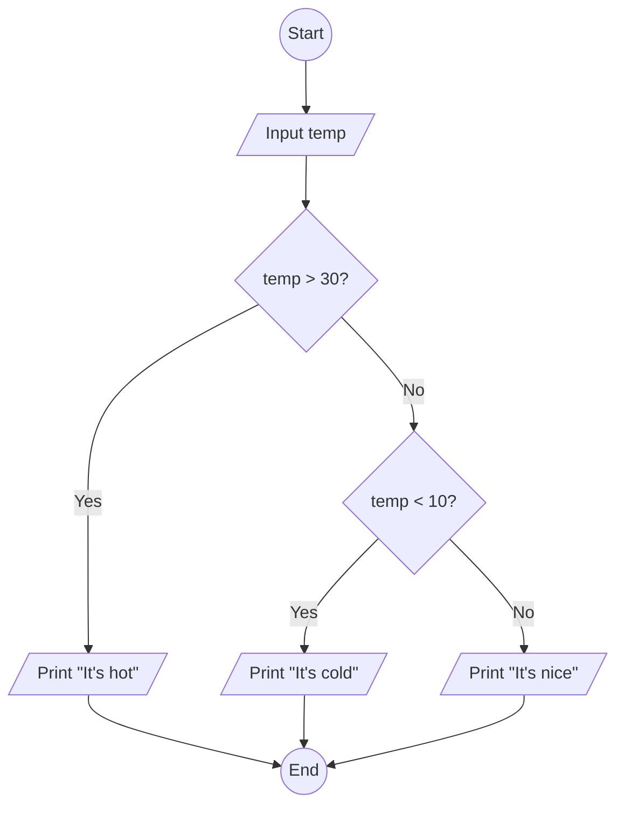

A working area for experiments.
##  My Markdown test document
This is a sample markdown document to test various features.
### Features to test:
- Headings
- Lists
- Links
- Images
- Code blocks
- Blockquotes
- Tables
- Emphasis (bold, italics)
- Horizontal rules
- Inline code
- Task lists
- Footnotes
- Mermaid diagrams
### Sample Code Block
```python
def hello_world():
    print("Hello, world!")
hello_world()
```
### Sample Table
| Feature       | Description                  |
|---------------|------------------------------|
| Headings      | Different levels of headings |
| Lists         | Ordered and unordered lists  |
| Links         | Hyperlinks to other pages    |
### Sample Link
[OpenAI](https://www.openai.com)
### Sample Image

### Sample Blockquote
> This is a blockquote example.
### Sample Horizontal Rule
---
### Sample Inline Code
Use the `print()` function to display output in Python.
### Sample Task List
- [x] Write markdown document
- [ ] Test markdown features
### Sample Footnote
This is a sample sentence with a footnote.[^1]
[^1]: This is the footnote text.
### Mermaid diagrams
Enter mermaid code to demonstrate flowchart diagraming

Another mermaid diagram


