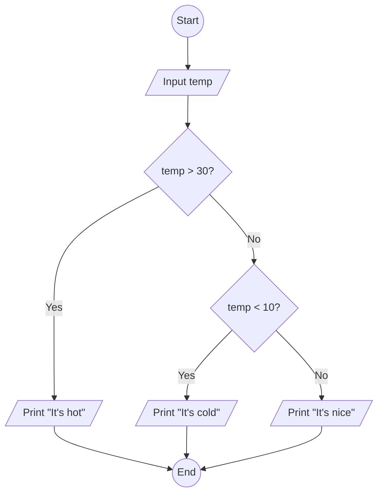

A working area for experiments.

Enter mermaid code to demonstrate flowchart diagraming

```mermaid
graph TD;
    A-->B;
    A-->C;
    B-->D;
    C-->D;
```
Another mermaid diagram

```mermaid
graph TD
    Start((Start)) --> Input[/Input temp/]
    Input --> CheckHigh{temp > 30?}
    
    CheckHigh -- Yes --> PrintHot[/Print "It's hot"/]
    CheckHigh -- No --> CheckLow{temp < 10?}
    
    CheckLow -- Yes --> PrintCold[/Print "It's cold"/]
    CheckLow -- No --> PrintNice[/Print "It's nice"/]
    
    PrintHot --> End((End))
    PrintCold --> End
    PrintNice --> End
```

